# 🟢 IDEAL SEIZURE TRANSFORMER DATAFLOW (What We Should Build)

**Status**: PROPOSED ARCHITECTURE
**Created**: December 12, 2024
**Purpose**: Document the CORRECT implementation based on OSS reference

---

## ✅ Correct Architecture Pattern

### 1. WHERE THE MODEL SHOULD LIVE
```
src/brain_go_brrr/infra/ml_models/
├── seizure_transformer.py      # COPIED architecture (NOT imported from reference)
├── seizure_transformer_wrapper.py  # Our wrapper with preprocessing/postprocessing
└── seizure_transformer_utils.py    # Preprocessing & postprocessing utilities
```

**PRINCIPLE**: Reference repos are for LEARNING, not IMPORTING. Copy the architecture, understand it, own it.

### 2. PREPROCESSING PIPELINE (From OSS)
```python
# src/brain_go_brrr/infra/ml_models/seizure_transformer_utils.py

class SeizurePreprocessor:
    """Exact preprocessing from Wu et al. 2025."""
    
    def __init__(self, fs: int = 256):
        self.fs = fs
        self.lowcut = 0.5
        self.highcut = 120
        # Pre-compute filter coefficients
        self.notch_1_b, self.notch_1_a = iirnotch(1, Q=30, fs=fs)
        self.notch_60_b, self.notch_60_a = iirnotch(60, Q=30, fs=fs)
    
    def preprocess(self, eeg: np.ndarray) -> np.ndarray:
        """Apply OSS preprocessing pipeline.
        
        1. Z-score normalization
        2. Resample to 256Hz if needed
        3. Bandpass filter (0.5-120Hz)
        4. Notch filters (1Hz, 60Hz)
        """
        # Z-score normalize
        eeg = (eeg - np.mean(eeg, axis=1, keepdims=True)) / np.std(eeg, axis=1, keepdims=True)
        
        # Resample if needed
        if self.fs != 256:
            new_n_samples = int(eeg.shape[1] * 256.0 / self.fs)
            eeg = resample(eeg, new_n_samples, axis=1)
        
        # Bandpass filter
        eeg = self.butter_bandpass_filter(eeg)
        
        # Notch filters
        eeg = lfilter(self.notch_1_b, self.notch_1_a, eeg)
        eeg = lfilter(self.notch_60_b, self.notch_60_a, eeg)
        
        return eeg
```

### 3. DATASET LOADER (Enhanced)
```python
# src/brain_go_brrr/infra/data/tusz_detection_dataset.py

class TUSZDetectionDataset:
    def __init__(
        self,
        root_dir: Path,
        split: str,
        cfg: WindowConfig,
        preprocessor: SeizurePreprocessor | None = None,  # ADD THIS
        ensure_unipolar: bool = True,  # ADD THIS
    ):
        self.preprocessor = preprocessor or SeizurePreprocessor()
        self.ensure_unipolar = ensure_unipolar
        
    def __getitem__(self, idx):
        # Load raw EDF
        raw = mne.io.read_raw_edf(edf_path, preload=True)
        
        # CRITICAL: Check montage
        if self.ensure_unipolar:
            if not self._is_unipolar(raw):
                raise ValueError(f"Non-unipolar montage detected in {edf_path}")
        
        # Get data in Volts
        data = raw.get_data()  # (channels, samples)
        
        # Apply preprocessing
        data = self.preprocessor.preprocess(data)
        
        # Window extraction...
        return torch.from_numpy(data), label
```

### 4. POST-PROCESSING (Match OSS Exactly)
```python
# src/brain_go_brrr/infra/eval/seizure_postprocessor.py

class SeizurePostProcessor:
    """Exact post-processing from Wu et al. 2025."""
    
    def __init__(
        self,
        threshold: float = 0.8,  # OSS default
        morph_open_size: int = 5,  # OSS default
        morph_close_size: int = 5,  # OSS default
        min_duration_sec: float = 2.0,  # OSS default
        fs: int = 256,
    ):
        self.threshold = threshold
        self.morph_open_size = morph_open_size
        self.morph_close_size = morph_close_size
        self.min_duration_sec = min_duration_sec
        self.fs = fs
    
    def postprocess(self, probs: np.ndarray) -> np.ndarray:
        """Apply OSS post-processing pipeline.
        
        1. Threshold at 0.8
        2. Morphological opening (remove short bursts)
        3. Morphological closing (fill gaps)
        4. Remove events < 2 seconds
        """
        # Threshold
        binary = (probs > self.threshold).astype(int)
        
        # Morphological opening
        binary = morphological_filter_1d(binary, "opening", self.morph_open_size)
        
        # Morphological closing
        binary = morphological_filter_1d(binary, "closing", self.morph_close_size)
        
        # Remove short events
        binary = remove_short_events(binary, self.min_duration_sec, self.fs)
        
        return binary
```

### 5. MODEL WRAPPER (Complete Integration)
```python
# src/brain_go_brrr/infra/ml_models/seizure_transformer_wrapper.py

class SeizureTransformerWrapper:
    """Complete wrapper with all OSS components."""
    
    def __init__(
        self,
        model_path: Path | None = None,
        device: str = "cuda",
    ):
        # Load model architecture (OUR copy, not reference)
        from brain_go_brrr.infra.ml_models.seizure_transformer import SeizureTransformer
        self.model = SeizureTransformer(
            in_channels=19,
            in_samples=15360,
            drop_rate=0.1,
        )
        
        # Load weights if provided
        if model_path and model_path.exists():
            checkpoint = torch.load(model_path, map_location=device)
            self.model.load_state_dict(checkpoint)
        
        self.model = self.model.to(device)
        self.model.eval()
        
        # Initialize processors
        self.preprocessor = SeizurePreprocessor(fs=256)
        self.postprocessor = SeizurePostProcessor()
    
    def predict(
        self,
        eeg: np.ndarray,
        apply_preprocessing: bool = True,
        apply_postprocessing: bool = True,
    ) -> np.ndarray:
        """Full prediction pipeline matching OSS."""
        
        # Preprocessing
        if apply_preprocessing:
            eeg = self.preprocessor.preprocess(eeg)
        
        # Sliding windows with proper overlap
        windows = self._create_windows(eeg)  # 60s @ 256Hz, 0% overlap for inference
        
        # Model inference
        predictions = []
        with torch.no_grad():
            for window in windows:
                x = torch.from_numpy(window).unsqueeze(0).to(self.device)
                pred = self.model(x)
                predictions.append(pred.cpu().numpy())
        
        # Concatenate predictions
        y_pred = np.concatenate(predictions).flatten()
        
        # Post-processing
        if apply_postprocessing:
            y_pred = self.postprocessor.postprocess(y_pred)
        
        return y_pred
```

### 6. TRAINING SCRIPT (Clean Import)
```python
# experiments/seizure_transformer/train_tusz.py

# CORRECT: Import from OUR codebase, not reference
from brain_go_brrr.infra.ml_models.seizure_transformer import SeizureTransformer
from brain_go_brrr.infra.ml_models.seizure_transformer_utils import SeizurePreprocessor
from brain_go_brrr.infra.data.tusz_detection_dataset import TUSZDetectionDataset
from brain_go_brrr.infra.eval.seizure_postprocessor import SeizurePostProcessor
from brain_go_brrr.infra.eval.nedc_metrics import NEDCEvaluator

def train():
    # Initialize components
    preprocessor = SeizurePreprocessor(fs=256)
    
    # Create dataset with preprocessing
    train_ds = TUSZDetectionDataset(
        root_dir=tusz_root,
        split="train",
        cfg=WindowConfig(
            fs=256,
            window_sec=60.0,
            stride_sec=60.0,  # No overlap for training (OSS style)
        ),
        preprocessor=preprocessor,
        ensure_unipolar=True,
    )
    
    # Model from OUR codebase
    model = SeizureTransformer(
        in_channels=19,
        in_samples=15360,
        drop_rate=0.1,
    )
    
    # Training loop...
```

---

## 📊 Correct Data Flow

```mermaid
graph TD
    A[TUSZ EDF Files<br/>Unipolar Montage] --> B[MNE Raw Object]
    B --> C[Check Montage<br/>Assert Unipolar]
    C --> D[Channel Mapping<br/>T3→T7, etc.]
    D --> E[Z-score Normalize]
    E --> F[Resample to 256Hz]
    F --> G[Bandpass 0.5-120Hz]
    G --> H[Notch 1Hz, 60Hz]
    H --> I[Sliding Windows<br/>60s, no overlap]
    I --> J[SeizureTransformer<br/>FROM src/]
    J --> K[Per-timestep Probs]
    K --> L[Threshold 0.8]
    L --> M[Morphological Ops]
    M --> N[Remove <2s Events]
    N --> O[NEDC Metrics]
```



---

## 🎯 Key Differences from Current

### 1. **NO REFERENCE IMPORTS**
- ❌ WRONG: `from wu_2025.architecture import SeizureTransformer`
- ✅ RIGHT: `from brain_go_brrr.infra.ml_models.seizure_transformer import SeizureTransformer`

### 2. **COMPLETE PREPROCESSING**
- Z-score normalization FIRST
- Resample to 256Hz if needed
- Bandpass filter (0.5-120Hz)
- Notch filters (1Hz, 60Hz)

### 3. **MONTAGE VALIDATION**
- MUST check for unipolar/referential montage
- Reject bipolar montages or convert them

### 4. **EXACT OSS POST-PROCESSING**
- Threshold: 0.8 (not configurable)
- Morphological kernel sizes: 5
- Min event duration: 2 seconds

### 5. **CLINICAL METRICS**
```python
# src/brain_go_brrr/infra/eval/nedc_metrics.py

class NEDCEvaluator:
    """NEDC-compliant seizure detection metrics."""
    
    def calculate_metrics(self, y_true, y_pred, patient_hours):
        # AUROC
        auroc = roc_auc_score(y_true, y_pred)
        
        # False alarms per 24 hours
        false_alarms = np.sum((y_pred == 1) & (y_true == 0))
        fa_per_24h = (false_alarms / patient_hours) * 24
        
        # TAES (Time-Aligned Event Scoring)
        taes_score = self._calculate_taes(y_true, y_pred)
        
        # Sensitivity at clinical threshold
        sensitivity = self._sensitivity_at_fa_threshold(y_true, y_pred, max_fa=5)
        
        return {
            'auroc': auroc,
            'fa_per_24h': fa_per_24h,
            'taes': taes_score,
            'sensitivity_at_5fa': sensitivity,
        }
```

---

## 🔧 Implementation Steps

1. **COPY** `architecture.py` → `src/brain_go_brrr/infra/ml_models/seizure_transformer.py`
2. **CREATE** `seizure_transformer_utils.py` with preprocessing pipeline
3. **CREATE** `seizure_postprocessor.py` with exact OSS post-processing
4. **UPDATE** `tusz_detection_dataset.py` to use preprocessor
5. **CREATE** `nedc_metrics.py` for clinical evaluation
6. **UPDATE** `train_tusz.py` to import from src/
7. **DELETE** wu_2025 package installation

---

## 📈 Expected Results

With correct implementation:
- AUROC: 0.876 (matching paper)
- FA/24h: ≤5 at 90% sensitivity
- Processing: ~2 batches/second on V100
- Convergence: ~20 epochs

---

## ⚠️ Critical Success Factors

1. **Unipolar montage** - Model ONLY works with referential EEG
2. **Exact preprocessing** - Order matters: normalize → resample → filter
3. **Window alignment** - 60s windows, no overlap for inference
4. **Post-processing params** - Must match OSS exactly
5. **Channel order** - 19 standard channels in correct order

---

## 🚀 Migration Plan

### Phase 1: Copy Architecture
```bash
cp reference_repos/SeizureTransformer/wu_2025/src/wu_2025/architecture.py \
   src/brain_go_brrr/infra/ml_models/seizure_transformer.py
```

### Phase 2: Remove Package
```bash
uv remove wu_2025
```

### Phase 3: Update Imports
```python
# In ALL files:
# FIND: from wu_2025.architecture import SeizureTransformer
# REPLACE: from brain_go_brrr.infra.ml_models.seizure_transformer import SeizureTransformer
```

### Phase 4: Add Preprocessing
- Implement in dataset or wrapper
- Ensure EXACT order from OSS

### Phase 5: Validate
- Train for 1 epoch
- Check AUROC > 0.5 (not random)
- Verify preprocessing with unit tests

---

**THIS IS HOW IT SHOULD BE DONE CORRECTLY**