# 🏆 NEDC INTEGRATION PLAN - STATUS UPDATE
## Current Implementation vs Canonical Plan

Canonical plan: docs/technical/NEDC_INTEGRATION_PLAN.md (SSOT). This status uses the normalized streams: Stream E (Evaluation backend: E1–E4) and Stream T (Tuning: T1–T3).

**Date:** 2025-09-13
**Branch:** `feature/nedc-integration`
**Status:** E1/E2 ✅ COMPLETE | T1 🏃 RUNNING | E4 🏗️ IN PROGRESS

---

## 📊 ACTUAL CURRENT STATE (What We've Built)

```
evaluation/
├── nedc_eeg_eval/v6.0.0/        ✅ VENDORED (untouched)
│   ├── bin/nedc_eeg_eval        ← Binary we call
│   └── lib/*.py                 ← Python libs (reference only)
│
├── nedc_scoring/                ✅ COMPLETE
│   ├── convert_predictions.py   ✅ Checkpoint → CSV_bi converter
│   ├── post_processing.py       ✅ Threshold/morphology/merge
│   ├── run_nedc.py             ✅ Backend toggle implemented
│   └── sweep_operating_point.py ✅ Running now (10/108 done)
│
└── seizure_evaluation/          🏗️ NEW (not in original plan!)
    └── taes/
        └── scorer.py            ✅ Native TAES implemented

experiments/
├── dev/
│   └── baseline/
│       ├── checkpoint.pkl       ✅ 1832 files processed
│       ├── nedc_results/        ✅ Baseline: 30.51% sens, 107 FA/24h
│       └── sweeps/              🏃 Running (10/108 combinations)
└── eval/                        ⏳ Waiting for frozen params
```

---

## 🔄 PHASE NAMING NORMALIZED

We have separated and labeled work into two streams to avoid confusion:
- Stream E (Evaluation backend): E1 Integration, E2 Conformance, E3 Backend toggle/side-by-side, E4 Native TAES (optional)
- Stream T (Operating-point tuning): T1 Dev sweep, T2 Freeze, T3 Single eval run

### 2. Parallel Work Discovery
We discovered Phase 4 (Native TAES) can run IN PARALLEL with Phase 2 (sweep).
- **Original plan:** Sequential phases
- **Reality:** Native implementation doesn't block tuning
- **Current:** Building both simultaneously

### 3. Backend Toggle Already Working
```bash
--backend nedc-binary    # ✅ Default, uses NEDC binary
--backend native-taes    # ✅ Our Python implementation
--backend both          # 🏗️ TODO: Side-by-side comparison
```

---

## ✅ COMPLETED (Against Original Plan)

### E1/E2: Integration & Conformance
- [x] Vendor isolation (nedc_eeg_eval untouched)
- [x] Golden fixtures (`tests/fixtures/nedc/expected_metrics.json`)
- [x] Backend toggle in `run_nedc.py`
- [x] CSV_bi generator with exact format
- [x] CI skip when binary missing
- [x] All P0/P1 issues fixed

### T1: Clinical Tuning (IN PROGRESS)
- [x] Dev checkpoint generated (1832 files)
- [x] Baseline metrics: 30.51% sensitivity, 107.29 FA/24h
- [🏃] Parameter sweep running in tmux
- [ ] Waiting for `recommended_params.json`

### E4: Native TAES (STARTED EARLY)
- [x] `seizure_evaluation/taes/scorer.py` implemented
- [x] Integrated with `--backend native-taes`
- [x] Basic tests passing on fixtures
- [ ] Full conformance validation needed
- [ ] Side-by-side comparison mode

---

## 🚨 DEVIATIONS FROM ORIGINAL PLAN

### 1. Added `seizure_evaluation/` Early
- **Plan said:** "Optional: native Python TAES (future)"
- **We did:** Started implementing while sweep runs
- **Why:** Independent work, efficient use of time

### 2. Simplified Native Implementation
- **Plan implied:** Copy/adapt NEDC Python code
- **We did:** Clean-room implementation from scratch
- **Why:** Cleaner ownership, no license issues

### 3. Dev Baseline Results
- **Expected:** FA/24h ≈ 137.5 (from plan)
- **Actual:** FA/24h = 107.29
- **Impact:** Still needs tuning to reach ≤ 10

---

## 🎯 CRITICAL PATH STATUS

```mermaid
graph LR
    A[Phase 1: Integration] -->|✅ DONE| B[Phase 2: Tuning]
    B -->|🏃 10/108| C[Freeze Params]
    C -->|⏳| D[Phase 3: Eval Run]
    B -.->|PARALLEL| E[Phase 4: Native TAES]
    E -->|🏗️| F[Conformance Tests]
```



**Blocking:** Sweep completion (ETA: ~3 hours)
**Non-blocking:** Native TAES development

---

## 📝 DECISIONS NEEDED FROM SENIOR REVIEW

### 1. Should we continue Phase 4 in parallel?
- **Pro:** Efficient use of time while sweep runs
- **Con:** Might need adjustments based on sweep results
- **Recommendation:** Continue, it's independent

### 2. Backend migration strategy?
- **Option A:** Keep both backends permanently
- **Option B:** Deprecate NEDC binary after validation
- **Option C:** Make native default, keep binary as fallback
- **Recommendation:** Option C

### 3. Scope of native implementation?
- **Minimal:** TAES only (current)
- **Full:** All 5 scorers (TAES, OVLP, EPOCH, DPALIGN, IRA)
- **Recommendation:** TAES only for now, others if needed

### 4. Sweep parameter space?
- **Current:** 108 combinations (4×3×3×3)
- **Question:** Too coarse? Need finer grid?
- **Data:** 10/108 done, no params meeting FA≤10 yet

---

## 🔮 NEXT STEPS (Assuming Approval)

### Immediate (While Sweep Runs)
1. [ ] Complete side-by-side comparison mode
2. [ ] Add conformance tests for native TAES
3. [ ] Document native vs NEDC deltas

### After Sweep Completes
1. [ ] Analyze `sweep_results.csv`
2. [ ] Select best params (FA ≤ 10, max sensitivity)
3. [ ] Freeze as `operating_point.json`
4. [ ] Run ONCE on eval split

### Validation Gates
- [ ] Native TAES within ±0.1% of NEDC
- [ ] Sweep finds params with FA ≤ 10
- [ ] Senior approval before eval run

---

## 💡 LESSONS LEARNED

1. **Parallel work is possible** - Native implementation doesn't block tuning
2. **Backend toggle crucial** - Allows gradual migration
3. **Baseline worse than expected** - 107 FA/24h vs plan's 137.5
4. **Clean-room better than adaptation** - Simpler to implement from scratch

---

## ❓ QUESTIONS FOR SENIOR

1. Is the parallel Phase 4 work acceptable?
2. Should we expand native implementation beyond TAES?
3. Are the sweep parameters sufficient?
4. Any concerns about the 107 FA/24h baseline?
5. Approval to continue current approach?

---

**Request:** Please review and provide guidance on:
- Continuing Phase 4 in parallel
- Sweep parameter adequacy
- Backend migration strategy
- Scope of native implementation
