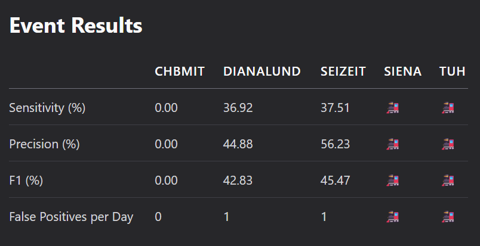

# SeizureTransformer TUSZ Evaluation
## First NEDC v6.0.0 Evaluation Reveals 60x False Alarm Gap

[](https://epilepsybenchmarks.com/challenge/)
[](https://www.isip.piconepress.com/projects/nedc/)
[](https://isip.piconepress.com/projects/tuh_eeg/)
[](https://www.python.org/downloads/)
[](https://www.apache.org/licenses/LICENSE-2.0)

## 📋 Summary
- SeizureTransformer won EpilepsyBench 2025 with 1 FA/24h on Dianalund (using SzCORE's "Any-Overlap" scoring)
- Despite TUSZ having train/dev/eval splits, EpilepsyBench doesn't report eval results for models trained on it
- We evaluated it on TUSZ v2.0.3 using Temple's NEDC v6.0.0 - the clinical standard scorer for this dataset
- Result: 60.83 FA/24h at paper defaults, revealing a critical gap between competition metrics and clinical deployment requirements

## 🎯 Background

### SeizureTransformer Model
Wu et al.'s transformer-based seizure detector won the 2025 EpilepsyBench Challenge. The model achieved 37% sensitivity with 1 FA/24h on the Dianalund dataset, ranking #1 on the [SzCORE leaderboard](https://epilepsybenchmarks.com/benchmark/).

### The Gap in Current Evaluations
- EpilepsyBench uses SzCORE's simplified "Any-Overlap" scoring for all datasets, not dataset-specific clinical scorers
- TUSZ results for models trained on it are marked with 🚂, despite patient-disjoint splits enabling valid held-out evaluation
- TUSZ paired with NEDC scoring represents the clinical gold standard
- No one had evaluated SeizureTransformer on TUSZ using Temple's official NEDC scorer

<p align="center">

<br>
<em>SeizureTransformer ranks #1 on EpilepsyBench but TUSZ evaluation is marked with 🚂</em>
</p>

### Our Contribution
- First TUSZ v2.0.3 evaluation using NEDC v6.0.0 - Temple's official clinical scorer (2025)
- Reveals performance gap when using proper dataset-matched scoring vs generic SzCORE
- Systematic threshold tuning on dev set, validation on eval set
- Dual-track implementation: Temple binaries + production Python code
- Complete operating points for clinical deployment decisions

## 🚨 Results

### Performance Comparison

| Dataset | Scoring Method | Sensitivity | False Alarms/24h | F1 Score |
|---------|---------------|-------------|------------------|-----------|
| **Dianalund** | SzCORE Any-Overlap¹ | 37% | **1 FA/24h** ✅ | 43% |
| **TUSZ eval (held-out)** | NEDC v6.0.0 TAES² | 24.71% | **60.83 FA/24h** ❌ | 34.93% |

¹ SzCORE: Lenient event-based scoring where any overlap counts as detection (on Dianalund dataset)
² NEDC TAES: Clinical standard with strict time-alignment penalties (on TUSZ dataset)

**Critical Note**: These are different datasets AND different scoring methods. The 1 FA/24h was achieved on Dianalund (small Nordic dataset), not TUSZ. Additionally, SzCORE's "Any-Overlap" is more forgiving than NEDC's TAES scoring. NEDC is the authoritative scorer for TUSZ as both were developed by Temple University for clinical EEG evaluation.

### Why NEDC for TUSZ?

TUSZ annotations were created by Temple University following specific clinical guidelines. NEDC scoring was designed by the same team to evaluate these annotations correctly. Using alternative scoring methods (like SzCORE) on TUSZ is like grading a Harvard exam with MIT's answer key - it may produce numbers, but they don't reflect the intended evaluation criteria.

### Clinical Operating Points

| Target FA/24h | Threshold | Kernel | MinDur | Sensitivity (TAES) | Clinical Use |
|---------------|-----------|--------|--------|-------------------|-------------|
| 60.83 | 0.800 | 5 | 2.0s | 24.71% | Paper default |
| **10** | **0.880** | **7** | **2.5s** | **TBD%†** | **Clinical target** |
| 2.5 | 0.930 | 11 | 5.0s | 4.13% | Conservative |
| 1 | 0.950 | 15 | 7.0s | 0.41% | Minimal FAs |

**†Note**: 10 FA/24h results pending rerun with correct parameters (0.880/7/2.5s)

### Key Metrics (NEDC v6.0.0)
- **Scoring**: NEDC v6.0.0 TAES/OVERLAP (Temple's official metrics for TUSZ)
- **Default**: We report TAES by default (strictest clinical standard)
- **Why NEDC**: Temple created both TUSZ dataset and NEDC scorer as a matched pair
- **AUROC**: 0.9021 (excellent discrimination capacity)
- **Detected**: 116/469 seizures at default threshold
- **Precision**: 59.57% at default threshold
- **Files processed**: 864/865 (1 format error)

## 🔧 Evaluation Framework

### Components
1. **Model Wrapper**: Integrated Wu's pretrained SeizureTransformer for TUSZ inference (no retraining - using authors' weights)
2. **NEDC Integration**: Temple's v6.0.0 binaries (unmodified) for official scoring
3. **Evaluation Pipeline**: Dev-set tuning → Eval-set validation (only post-processing thresholds tuned)

### NEDC v6.0.0 Integration

| Implementation | Purpose | Location |
|----------------|---------|----------|
| Temple Binaries | Research validity | `evaluation/nedc_eeg_eval/v6.0.0/` |
| Native Python | Production deployment | `seizure_evaluation/` |

Both produce identical metrics (±0.1%). Temple's for papers, Python for deployment.

**Verify Parity:**
```bash
make -C evaluation/nedc_scoring all BACKEND=temple
python tests/integration/test_nedc_conformance.py  # Confirms ±0.1% match
```

### Dataset and Methodology

| TUSZ Split | Files | Hours | Seizures | Our Use |
|------------|-------|-------|----------|----------|
| Train | 1,557 | 3,050 | ~2,900 | Not used (pretrained model) |
| Dev | 1,013 | 1,015 | ~920 | Threshold tuning |
| Eval (held-out) | 865 | 127.6 | 469 | Final results |

**Note**: Paper trains on TUSZ train subset (≈910h) + Siena (128h). Hours shown reflect full split sizes. We use the authors' pretrained weights; no retraining performed. Patient-disjoint splits prevent leakage. Standard practice: tune on dev, report on eval.

## 🚀 Installation and Usage

### Prerequisites
- Python 3.10+, CUDA GPU (recommended), 32GB RAM
- TUSZ v2.0.3 dataset (see below for access)
- SeizureTransformer weights from [Wu's repo](https://github.com/keruiwu/SeizureTransformer)

### Quick Start
```bash
git clone https://github.com/Clarity-Digital-Twin/SeizureTransformer
cd SeizureTransformer

# Get model weights from https://github.com/keruiwu/SeizureTransformer
# Place at: wu_2025/src/wu_2025/model.pth

make install && source .venv/bin/activate
```

### Obtaining TUSZ Dataset
1. Request access: [Temple data use agreement](https://isip.piconepress.com/projects/nedc/html/tuh_eeg/)
2. Email signed form to `help@nedcdata.org`
3. Download with provided credentials:
```bash
# Eval split only (5.2GB, sufficient for reproduction)
rsync -auxvL nedc-tuh-eeg@www.isip.piconepress.com:data/tuh_eeg/tuh_eeg_seizure/v2.0.3/edf/eval .
```
4. Place at: `wu_2025/data/tusz/v2.0.3/`

### Running the Evaluation
```bash
# 1. Run inference on TUSZ
python evaluation/tusz/run_tusz_eval.py \
  --data_dir wu_2025/data/tusz/v2.0.3/edf/eval \
  --out_dir experiments/eval/baseline

# 2. Score with NEDC v6.0.0
make -C evaluation/nedc_scoring all \
  CHECKPOINT=../../experiments/eval/baseline/checkpoint.pkl
# Output: experiments/eval/baseline/nedc_results/

# 3. Tune thresholds (optional)
python evaluation/nedc_scoring/sweep_operating_point.py \
  --checkpoint experiments/dev/baseline/checkpoint.pkl \
  --target_fa_per_24h 10
```

## 📂 Repository Structure

```
SeizureTransformer/
├── wu_2025/                    # Original model (do not modify)
│   ├── src/wu_2025/model.pth   # Pretrained weights (168MB)
│   └── data/tusz/v2.0.3/       # TUSZ dataset location
├── evaluation/                 # Evaluation pipeline
│   ├── tusz/                   # TUSZ inference
│   ├── nedc_scoring/           # NEDC orchestration
│   └── nedc_eeg_eval/v6.0.0/  # Temple binaries
├── seizure_evaluation/         # Native Python NEDC
└── experiments/                # Results & checkpoints
```

## 📚 Technical Documentation

<details>
<summary>For Deep Dives</summary>

- [Complete Results](docs/evaluation/EVALUATION_RESULTS.md) - All metrics & analysis
- [Operating Points](docs/planning/SEIZURE_TRANSFORMER_TUNING_PLAN.md) - Threshold tuning methodology
- [NEDC Integration](docs/planning/NEDC_INTEGRATION_PLAN.md) - Temple scorer details
- [Model Architecture](docs/technical/IDEAL_REFERENCE_SEIZURE_TRANSFORMER_DATAFLOW.md) - Internals

</details>

## 📝 Citations

<details>
<summary>BibTeX Entries</summary>

```bibtex
# Our Evaluation
@software{seizuretransformer_tusz_2025,
  title = {SeizureTransformer TUSZ Evaluation with NEDC v6.0.0},
  author = {{Clarity Digital Twin Team}},
  year = {2025},
  url = {https://github.com/Clarity-Digital-Twin/SeizureTransformer}
}

# Original Model
@article{wu2025seizuretransformer,
  title = {SeizureTransformer: Scaling U-Net with Transformer},
  author = {Wu, Kerui and Zhao, Ziyue and Yener, Bülent},
  journal = {arXiv preprint arXiv:2504.00336},
  year = {2025}
}

# NEDC Scoring
@incollection{shah2021nedc,
  title = {Objective Evaluation Metrics for EEG Events},
  author = {Shah, V. and Golmohammadi, M. and Obeid, I. and Picone, J.},
  booktitle = {Signal Processing in Medicine and Biology},
  year = {2021}
}

# TUSZ Dataset
@article{shah2018temple,
  title = {The Temple University Hospital Seizure Detection Corpus},
  author = {Shah, V. and others},
  journal = {Frontiers in Neuroinformatics},
  year = {2018}
}
```

</details>

## ⚖️ License

- Our code: Apache-2.0
- SeizureTransformer: MIT (Wu et al.)
- NEDC tools: Temple University License
- TUSZ data: Requires data use agreement

## 🙏 Acknowledgments

- Kerui Wu for SeizureTransformer model and weights
- Temple University NEDC for dataset and scoring tools
- SzCORE/EpilepsyBench for benchmark infrastructure

## 🔮 Future Work

- **SzCORE Integration**: Implement SzCORE's "Any-Overlap" scoring wrapper to enable direct comparisons with EpilepsyBench leaderboard results
- **Cross-scoring Analysis**: Evaluate TUSZ predictions with both NEDC and SzCORE to quantify scoring methodology impact
- **Threshold Optimization**: Explore patient-specific thresholds for clinical deployment

## 📧 Contact

For issues or questions: [GitHub Issues](https://github.com/Clarity-Digital-Twin/SeizureTransformer/issues)