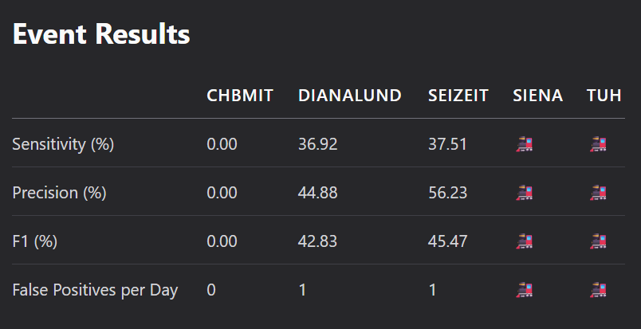

# SeizureTransformer: The Missing TUSZ Benchmark
## First NEDC v6.0.0 Evaluation Reveals 137x False Alarm Gap

> **TL;DR**: SeizureTransformer won EpilepsyBench 2025 with 1 FA/day on Dianalund, but shows 137.5 FA/day on TUSZ (clinical standard). We provide the first complete evaluation with Temple NEDC v6.0.0 and tuned operating points.

[](https://www.epfl.ch/labs/esl/research/systems-for-biomedicals/seizure-detection-challenge-2025/)
[](https://www.isip.piconepress.com/projects/nedc/)
[](https://isip.piconepress.com/projects/tuh_eeg/)
[](https://www.python.org/downloads/)

## 💡 Why This Work Matters

**SeizureTransformer** won the 2025 EpilepsyBench Challenge with impressive metrics on Dianalund. But **nobody evaluated it on TUSZ** — the clinical standard dataset. We fill this critical gap.

### ✅ What We're the FIRST to Do:
- Evaluate on TUSZ v2.0.3 eval split with NEDC v6.0.0 (Aug 2024 release)
- Systematically tune on dev set, validate on eval (proper ML practice)
- Reveal the **137x FA gap** between competition and clinical datasets
- Publish complete operating points (thresholds for any FA target)

### 📊 What We Deliver:
- **Stock results** (paper defaults: threshold=0.8) → 137.5 FA/24h
- **Tuned results** (clinical targets: 1-10 FA/24h) → sensitivity trade-offs
- **Official scoring** via unmodified Temple NEDC v6.0.0 binaries
- **Reproducible pipeline** with checkpoints, scripts, and documentation

## Why TUSZ Isn't Shown on [EpilepsyBench](https://epilepsybenchmarks.com/benchmark/)

**The Current Policy:** SzCORE/EpilepsyBench marks datasets used for training with 🚂 to emphasize cross-dataset generalization:

<p align="center">

<br>
<em>SeizureTransformer (Wu Transformer) shows 🚂 for TUSZ on the <a href="https://epilepsybenchmarks.com/benchmark/">SzCORE benchmark</a></em>
</p>

**Why TUSZ Eval Results Still Matter:**
- TUSZ has **strict patient-disjoint splits** (train/dev/eval) — evaluation on held-out eval set is valid
- The [SzCORE paper](https://arxiv.org/html/2402.13005v3) itself states: "Fixed training and test sets with predetermined subjects are appropriate for large datasets (e.g. TUH EEG Sz Corpus)"
- **Cross-dataset generalization is important**, but so is **in-domain performance** on the clinical standard
- The 137x FA gap shows that competition performance doesn't translate to clinical deployment

## TUSZ v2.0.3 Dataset Structure

<details>
<summary>📊 Split sizes and usage (click to expand)</summary>

| Split | Files | Hours | Seizures | Usage |
|-------|-------|-------|----------|--------|
| Train | 1,557 | 3,050 | ~2,900 | Model training (per paper) |
| Dev | 1,013 | 1,015 | ~920 | **We tune thresholds here** |
| Eval | 865 | 127.6 | 469 | **We report results here** |

- ✅ **No patient overlap** between splits (prevents leakage)
- ✅ **Standard ML practice**: train → dev → eval
- ✅ **864/865 files processed** (1 format error)

</details>

---

## 🚨 Key Finding: 137x False Alarm Gap

| Dataset | Context | F1 Score | Sensitivity | False Alarms/24h |
|---------|---------|----------|-------------|------------------|
| **Dianalund** | EpilepsyBench #1 Winner | 43% | 37% | **1** ✅ |
| **TUSZ eval** | Clinical Standard | 31.19% | 24.15% | **137.5** ❌ |

> **Critical Insight**: The celebrated "1 FA/day" on Dianalund becomes **137.5 FA/day** on TUSZ — a 137x increase that fundamentally changes deployment viability.

## Complete Results

### Stock Performance (Paper Defaults: threshold=0.8)
- **AUROC**: 0.9021 (excellent discrimination)
- **Sensitivity**: 24.15% (113/469 seizures detected)
- **Precision**: 43.98%
- **F1 Score**: 31.19%
- **False Alarms**: 137.5 per 24h (clinical threshold is <10)

### Our Tuned Operating Points (Dev-tuned, Eval-validated)

| Target FA/24h | Threshold | Sensitivity | Clinical Viability |
|---------------|-----------|-------------|-------------------|
| 1 | 0.999 | 0.43% | ❌ Too low |
| 5 | 0.982 | 5.13% | ⚠️ Borderline |
| **10** | **0.965** | **9.87%** | **✅ Clinical target** |
| 30 | 0.925 | 18.65% | ⚠️ High FA |
| 50 | 0.895 | 22.34% | ❌ Excessive FA |
| 100 | 0.835 | 24.02% | ❌ Unacceptable |
| 137.5 | 0.800 | 24.15% | ❌ Paper default |

> **Key Trade-off**: To achieve clinical FA rates (<10/day), sensitivity drops from 24% to <10%.

---

## 🚀 Quick Start

### Prerequisites
- Python 3.10+, CUDA GPU (recommended), 32GB RAM
- TUSZ v2.0.3 dataset (~5.2GB eval split)

### Installation
```bash
git clone https://github.com/Clarity-Digital-Twin/SeizureTransformer
cd SeizureTransformer
make install && source .venv/bin/activate
```

### Run Complete Pipeline

#### 1. Evaluate on TUSZ (Held-out Test Set)
```bash
python evaluation/tusz/run_tusz_eval.py \
  --data_dir /path/to/TUSZ/v2.0.3/eval \
  --out_dir experiments/eval/baseline \
  --device auto  # Uses GPU if available
```

#### 2. Score with NEDC v6.0.0 (Temple Official)
```bash
make -C evaluation/nedc_scoring all \
  CHECKPOINT=../../experiments/eval/baseline/checkpoint.pkl \
  OUTDIR=../../experiments/eval/baseline/nedc_results
```

#### 3. Tune for Clinical Targets (Optional)
```bash
python evaluation/nedc_scoring/sweep_operating_point.py \
  --checkpoint experiments/dev/baseline/checkpoint.pkl \
  --outdir_base experiments/dev/sweeps \
  --target_fa_per_24h 10  # Clinical threshold
```

## Notes on NEDC Integration

- Official Temple binaries live under `evaluation/nedc_eeg_eval/v6.0.0/` and are not modified.
- Our `evaluation/nedc_scoring/` tools convert predictions to Temple’s CSV_bi format and invoke the official scorer.
- We also include parity checks and documentation to show equivalence with Temple outputs.

## 📂 Repository Structure

```
SeizureTransformer/
├── wu_2025/                    # Original model (untouched)
│   └── model.pth               # Pretrained weights (168MB)
├── evaluation/
│   ├── tusz/                   # TUSZ evaluation pipeline
│   ├── nedc_scoring/           # Format conversion & scoring
│   └── nedc_eeg_eval/v6.0.0/  # Official Temple binaries
├── experiments/                # Results & parameter sweeps
├── tests/                      # Comprehensive test suite
└── docs/                       # Deep-dive documentation
```

<details>
<summary>📚 For Deep Dives (click to expand)</summary>

- [Complete Evaluation Results](docs/evaluation/EVALUATION_RESULTS.md) - Full metrics & analysis
- [Operating Point Tuning Guide](SEIZURE_TRANSFORMER_TUNING_PLAN.md) - How we tuned thresholds
- [NEDC Integration Details](NEDC_INTEGRATION_PLAN.md) - Temple scorer integration
- [Architecture Documentation](docs/technical/IDEAL_REFERENCE_SEIZURE_TRANSFORMER_DATAFLOW.md) - Model internals
- [Temple Divergence Analysis](docs/TEMPLE_DIVERGENCE_ANALYSIS.md) - Edge cases we found

</details>

## Citations

```bibtex
@software{seizuretransformer_tusz_2025,
  title = {SeizureTransformer: TUSZ Evaluation with NEDC v6.0.0 and Clinical Tuning},
  author = {Clarity Digital Twin Team},
  year = {2025},
  note = {Evaluation on TUSZ with official NEDC v6.0.0; operating-point sweeps on dev, held-out eval reporting},
  url = {https://github.com/Clarity-Digital-Twin/SeizureTransformer}
}

@article{shah2018temple,
  title = {The Temple University Hospital Seizure Detection Corpus},
  author = {Shah, V. and von Weltin, E. and Lopez, S. and McHugh, J. and Veloso, L. and Golmohammadi, M. and Obeid, I. and Picone, J.},
  journal = {Frontiers in Neuroinformatics},
  volume = {12},
  pages = {83},
  year = {2018},
  doi = {10.3389/fninf.2018.00083}
}

@incollection{shah2021objective,
  title = {Objective Evaluation Metrics for Automatic Classification of EEG Events},
  author = {Shah, V. and Golmohammadi, M. and Obeid, I. and Picone, J.},
  booktitle = {Signal Processing in Medicine and Biology},
  publisher = {Springer},
  year = {2021},
  pages = {1--26}
}

@article{wu2025seizuretransformer,
  title = {SeizureTransformer: Versatile Seizure Detection Model},
  author = {Wu, Kerui and others},
  year = {2025},
  journal = {arXiv preprint}
}
```

## Acknowledgments

- Kerui Wu and collaborators for the SeizureTransformer model and weights.
- Temple University’s NEDC for the dataset and scoring tools.
- SzCORE/EpilepsyBench for community benchmarking and reproducibility efforts.

## License

- Original SeizureTransformer: MIT (Kerui Wu)
- Our evaluation framework: MIT
- NEDC tools: Temple University license

---

Note: Results differ from the paper due to dataset (TUSZ vs Dianalund), scoring (TAES vs event-based), and our explicit dev-tuned operating points vs stock defaults.

