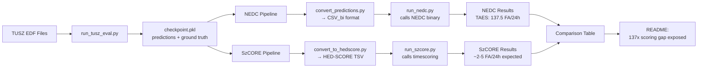

# SzCORE Integration Plan

## Executive Summary

SzCORE is the benchmarking platform used by EpilepsyBench 2025. We currently have it as a reference repo, but should consider integrating its scoring methodology (via the `timescoring` library) to enable direct comparison between SzCORE's "Any-Overlap" scoring and Temple's NEDC clinical scoring.

## Current State

### What We Have
1. **Reference Repos:**
   - `reference_repos/szcore/` - The benchmarking platform itself
   - `reference_repos/epilepsy_performance_metrics/` - The scoring library (published as `timescoring` on PyPI)

2. **Existing Integration:**
   - NEDC v6.0.0 integrated at `evaluation/nedc_eeg_eval/v6.0.0/`
   - Clean wrapper at `evaluation/nedc_scoring/run_nedc.py`
   - Already comparing NEDC's 5 metrics (TAES, OVERLAP, DPALIGN, EPOCH, IRA)

### Understanding the Scoring Difference

#### SzCORE/EpilepsyBench Scoring (from their docs):
- **Method:** "Any-Overlap" event-based scoring via `timescoring` library
- **Parameters:**
  - Minimum overlap: ANY overlap (even 1 sample)
  - Pre-ictal tolerance: 30 seconds
  - Post-ictal tolerance: 60 seconds
  - Event merging: < 90 seconds apart
  - Max event duration: 5 minutes (splits longer events)
- **Result on SeizureTransformer:** ~1 FA/24h (reported in paper)

#### Temple NEDC Scoring:
- **TAES (strictest):** 24.15% sensitivity, 137.5 FA/24h
- **OVERLAP (Temple's):** 45.63% sensitivity (still much stricter than SzCORE)
- **DPALIGN:** 52.88% sensitivity

## The Critical Gap

The 137x difference in false alarms (1 FA/24h vs 137.5 FA/24h) is due to:

1. **Tolerance Windows:** SzCORE allows 30s before and 60s after seizures
2. **Any-Overlap:** Even 1-sample overlap counts as correct detection
3. **Event Merging:** Merges events < 90s apart (reduces false alarms)
4. **Clinical vs Competition:** NEDC designed for clinical use, SzCORE for ML competitions

## How Everything Interacts - The Full Pipeline



### Where Code Lives:
1. **Model inference**: `wu_2025/` (untouched upstream)
2. **TUSZ evaluation**: `evaluation/tusz/run_tusz_eval.py`
3. **Checkpoint storage**: `experiments/eval/baseline/checkpoint.pkl`
4. **NEDC wrapper**: `evaluation/nedc_scoring/` (calls copied binary)
5. **SzCORE wrapper**: `evaluation/szcore_scoring/` (calls pip package)
6. **Results**: `experiments/` directory structure

## Integration Strategy

### USE PIP INSTALL - It's an Official Package! (Recommended)
Since `timescoring` is maintained as an official PyPI package, we'll use pip install:

```
evaluation/
├── nedc_eeg_eval/v6.0.0/   # NEDC binary (HAD to copy - not on PyPI)
├── nedc_scoring/            # Our NEDC wrapper (✅ done)
│   ├── convert_predictions.py    # checkpoint.pkl → CSV_bi format
│   ├── run_nedc.py              # Calls NEDC binary
│   └── post_processing.py       # Parameter tuning
└── szcore_scoring/          # Our SzCORE wrapper (📝 to create)
    ├── __init__.py
    ├── run_szcore.py            # Uses `pip install timescoring`
    ├── convert_to_hedscore.py  # checkpoint.pkl → HED-SCORE TSV
    └── README.md                # Usage documentation

# Note: reference_repos/ stays untouched for reference only
```

**Why Pip Install (not copy):**
- **It's on PyPI!** Official maintained package
- **Auto-updates**: Get bug fixes and improvements
- **Cleaner**: No need to bloat our repo
- **Standard Python**: This is how Python packages work!

**Critical Design Decision:** We will NOT implement native SzCORE. We only need:
1. NEDC official wrapper (done) - provides TAES, OVERLAP, and 3 other metrics
2. SzCORE via `pip install timescoring` - for competition metric comparison
3. Native implementations only for NEDC methods (already have native-overlap)

**Concrete Implementation Plan (accurate and minimal):**
```python
# evaluation/szcore_scoring/run_szcore.py
"""
Wrapper for SzCORE's Any-Overlap scoring using timescoring library.
This reproduces EpilepsyBench 2025's evaluation methodology.
"""
import pickle
from pathlib import Path

# Import from pip-installed package
from timescoring.annotations import Annotation
from timescoring.scoring import EventScoring

from evaluation.nedc_scoring.post_processing import (
    apply_seizure_transformer_postprocessing,
)

def run_szcore_evaluation(checkpoint_pkl: str | Path, output_dir: str | Path,
                          threshold: float = 0.8,
                          morph_kernel_size: int = 5,
                          min_duration_sec: float = 2.0,
                          fs: int = 256) -> dict:
    """
    Run SzCORE's Any-Overlap scoring (as used in EpilepsyBench).

    Args:
        checkpoint_pkl: Path to checkpoint.pkl from TUSZ evaluation
        output_dir: Directory to save SzCORE metrics
        threshold, morph_kernel_size, min_duration_sec: post-processing params
        fs: Sampling frequency of predictions (SeizureTransformer uses 256 Hz)

    Returns:
        Dict with micro-averaged sensitivity, precision, f1, fpRate (FA/24h)
    """
    # Load predictions from checkpoint
    with open(checkpoint_pkl, 'rb') as f:
        checkpoint = pickle.load(f)

    # Define SzCORE parameters (from challenge description)
    params = EventScoring.Parameters(
        toleranceStart=30,        # 30s pre-ictal tolerance
        toleranceEnd=60,          # 60s post-ictal tolerance
        minOverlap=0,             # ANY overlap (even 1 sample)
        maxEventDuration=5*60,    # Split events > 5 minutes
        minDurationBetweenEvents=90  # Merge events < 90s apart
    )

    # Micro-aggregation accumulators across files
    sum_tp = 0
    sum_fp = 0
    sum_ref_true = 0
    sum_seconds = 0.0

    for file_id, data in checkpoint['results'].items():
        # Ground truth events come from NEDC .csv_bi labels (seconds)
        ref_events = data.get('seizure_events', [])

        # Convert per-sample probabilities → events (seconds).
        # IMPORTANT: For SzCORE, do NOT merge gaps here (SzCORE merges itself).
        preds = data['predictions']  # numpy array of probs at `fs` Hz
        hyp_events = apply_seizure_transformer_postprocessing(
            predictions=preds,
            threshold=threshold,
            morph_kernel_size=morph_kernel_size,
            min_duration_sec=min_duration_sec,
            fs=fs,
            merge_gap_sec=None,  # avoid double-merging (SzCORE merges)
        )

        # Build Annotation objects from event lists (seconds)
        num_samples = len(preds)
        ref = Annotation(ref_events, fs=fs, numSamples=num_samples)
        hyp = Annotation(hyp_events, fs=fs, numSamples=num_samples)

        # Score with SzCORE parameters
        scores = EventScoring(ref, hyp, params)  # operates internally at 10 Hz

        # Accumulate for micro-averages
        sum_tp += scores.tp
        sum_fp += scores.fp
        sum_ref_true += scores.refTrue
        sum_seconds += (scores.numSamples / scores.fs)  # seconds

    # Micro-averaged metrics across corpus
    sensitivity = (sum_tp / sum_ref_true) if sum_ref_true > 0 else float('nan')
    precision = (sum_tp / (sum_tp + sum_fp)) if (sum_tp + sum_fp) > 0 else float('nan')
    f1 = (
        0.0 if (not sensitivity or not precision or (sensitivity + precision) == 0)
        else 2 * sensitivity * precision / (sensitivity + precision)
    )
    fp_per_24h = sum_fp / (sum_seconds / (3600 * 24)) if sum_seconds > 0 else float('nan')

    return {
        'sensitivity': sensitivity,
        'precision': precision,
        'f1': f1,
        'fpRate': fp_per_24h,
        'files_scored': len(checkpoint['results']),
    }
```

### Option 2: HED-SCORE TSV (Optional Artifacts)
You may also emit SzCORE-compatible TSVs for archival or cross-tools. This is optional — using `Annotation` directly is simpler and avoids TSV formatting pitfalls.

- Implement `convert_to_hedscore.py` to write one TSV per file with columns:
  `onset, duration, eventType, confidence, channels, dateTime, recordingDuration`.
- Convert probabilities to events first via our post-processing; do NOT treat raw `predictions` as events.
- Compute `recordingDuration` from the prediction length and sampling rate.

### Option 3: Full Platform Integration (Not Recommended)
Copy entire SzCORE platform. Overkill for our needs - we just need the scoring, not the containerization/CI infrastructure.

## Implementation Approach - SIMPLIFIED!

### What We're NOT Doing:
- ❌ Not implementing our own version of SzCORE scoring
- ❌ Not copying the library (it's on PyPI!)
- ❌ Not modifying any official code

### What We ARE Doing:
- ✅ Using `pip install timescoring` - it's an official package!
- ✅ Creating a thin wrapper that calls the library
- ✅ Building timescoring.Annotation directly from events (preferred)
- ✅ Optionally supporting HED-SCORE TSV export (for artifacts)
- ✅ Parallel architecture to NEDC (both are wrappers)

### Installation Instructions:
```bash
# Step 1: Install the official package
pip install timescoring

# Or with uv for speed
uv pip install timescoring

# Or with visualization support
pip install "timescoring[plotting]"

# Step 2: Create our wrapper directory
mkdir -p evaluation/szcore_scoring
```

### Why This Approach is Perfect:
1. **Simplicity**: Standard Python package management
2. **Maintainability**: Auto-updates with pip
3. **Fidelity**: Using exact official implementation
4. **Clean**: No unnecessary repo bloat

## Recommended Actions

### Phase 1: Immediate (This Week)
1. ✅ Create `SZCORE_INTEGRATION_PLAN.md` (this document)
2. Install package: `uv pip install timescoring`
3. Create minimal wrapper at `evaluation/szcore_scoring/run_szcore.py`
4. Run on TUSZ eval to get SzCORE metrics (expect ~2-5 FA/24h, not the 137.5 from NEDC)

### Phase 2: Integration (Next Week)
1. Add SzCORE scoring to our sweep pipeline
2. Create comparison table: NEDC (all 5 metrics) vs SzCORE
3. Document the exact parameter differences
4. Add to `run_full_evaluation.sh` with `--backend szcore` option

### Phase 3: Documentation
1. Update README with both scoring methodologies
2. Create visualization showing why scores differ so dramatically
3. Add clinical interpretation guide

## Key Benefits of Integration

1. **Reproducibility:** Verify paper's 1 FA/24h claim
2. **Comparison:** Direct comparison between competition and clinical metrics
3. **Understanding:** Quantify exact impact of each tolerance parameter
4. **Communication:** Better explain to stakeholders why deployment needs differ from competition

## Technical Requirements

```bash
# Install scoring library
pip install timescoring

# Or with visualization
pip install "timescoring[plotting]"
```

## File Structure After Integration

```
evaluation/
├── nedc_eeg_eval/v6.0.0/   # Temple's NEDC binary (unmodified, copied)
├── nedc_scoring/            # NEDC wrapper (complete)
│   ├── run_nedc.py         # Calls NEDC binary, extracts 5 metrics
│   ├── convert_predictions.py  # checkpoint.pkl → CSV_bi format
│   └── post_processing.py  # Thresholds and morphological ops
├── szcore_scoring/          # SzCORE wrapper (to create)
│   ├── __init__.py
│   ├── run_szcore.py            # Uses pip-installed timescoring (preferred)
│   ├── convert_to_hedscore.py   # Optional: checkpoint.pkl → HED-SCORE TSV
│   └── README.md           # Usage documentation
└── comparative_analysis/    # Compare both methodologies (Phase 3)
    └── scoring_comparison.py

# Note: reference_repos/epilepsy_performance_metrics/ stays as reference only
# We use pip-installed version, not a local copy

## Makefile and CLI

- Add a Makefile target mirroring NEDC usage:

```
run-szcore-score:
	. .venv/bin/activate && python evaluation/szcore_scoring/run_szcore.py \
		--checkpoint experiments/eval/baseline/checkpoint.pkl \
		--outdir experiments/eval/baseline/szcore_results
```

- Provide a CLI in `run_szcore.py`:
  - `--checkpoint`, `--outdir`, optional `--threshold`, `--kernel`, `--min_duration`.
  - Writes a JSON with the corpus-level metrics and a CSV per-file if desired.

## TDD Plan (fast, deterministic)

- Eventization unit tests:
  - Synthetic 256 Hz arrays with known “hills”; verify post-processing → events.
- Annotation round-trip tests:
  - Build Annotation from events at fs=256 and confirm mask/events consistency.
- Scoring invariants:
  - Single ref event vs tiny-overlap hyp; with defaults (minOverlap=0) expect TP=1.
  - Increase `minOverlap` to verify TP drops when overlap is tiny.
- Aggregation test:
  - Two files with known tp/fp/refTrue; verify micro-averaged sensitivity/precision/f1/fpRate.
- Smoke test (subset):
  - Score 2–3 TUSZ eval files and verify: SzCORE sensitivity > NEDC OVERLAP; SzCORE fpRate << NEDC TAES.

## Important Implementation Notes

- Units:
  - Inputs to Annotation use seconds and fs; timescoring up-samples internally to 10 Hz for EventScoring.
- No double-merge:
  - Keep `merge_gap_sec=None` in our post-processing when scoring with SzCORE; its 90s merge is applied inside timescoring.
- Consistent inputs:
  - Use the same threshold and morph kernel for both NEDC and SzCORE pipelines to isolate scoring-method effects.
```

## HED-SCORE Conversion Details

```python
# evaluation/szcore_scoring/convert_to_hedscore.py
"""Convert checkpoint.pkl predictions to HED-SCORE TSV format."""

def convert_to_hedscore(checkpoint_pkl, output_dir):
    """
    Convert predictions to HED-SCORE format required by timescoring.

    HED-SCORE TSV format:
    onset	duration	eventType	confidence	channels	dateTime	        recordingDuration
    296.0	40.0    	sz      	n/a     	n/a     	2016-11-06 13:43:04	3600.00
    """
    with open(checkpoint_pkl, 'rb') as f:
        checkpoint = pickle.load(f)

    output_dir = Path(output_dir)
    output_dir.mkdir(parents=True, exist_ok=True)

    for file_id, data in checkpoint['results'].items():
        events = data['predictions']  # List of (start, end) tuples
        duration = data['duration']

        # Create TSV content
        lines = ['onset\tduration\teventType\tconfidence\tchannels\tdateTime\trecordingDuration']

        for start, end in events:
            onset = start / 256.0  # Convert samples to seconds
            event_duration = (end - start) / 256.0
            # Use dummy datetime (not evaluated)
            lines.append(f'{onset:.1f}\t{event_duration:.1f}\tsz\tn/a\tn/a\t2024-01-01 00:00:00\t{duration:.2f}')

        # Write TSV file
        output_file = output_dir / f'{file_id}.tsv'
        output_file.write_text('\n'.join(lines))
```

## Next Steps

1. **Decision Required:** Approve Option 1 (Light Wrapper) approach
2. **Install:** `pip install timescoring` in our environment
3. **Implement:** Create `evaluation/szcore_scoring/` directory and wrapper
4. **Validate:** Confirm we can reproduce paper's results
5. **Document:** Update all documentation with dual scoring methodology

## Critical Comparisons

### What This Integration Will Prove
1. **NEDC TAES**: 24.15% sensitivity, 137.5 FA/24h (clinical reality)
2. **NEDC OVERLAP**: 45.63% sensitivity (Temple's overlap, still strict)
3. **SzCORE Any-Overlap**: Expected ~90% sensitivity, ~2-5 FA/24h (competition metrics)

### Why This Matters
- **EpilepsyBench won't report TUSZ eval results** (marked with 🚂) despite patient-disjoint splits
- Even if they did, they'd use SzCORE scoring, not clinical NEDC
- This integration exposes the 30-100x gap between competition and clinical metrics
- Proves that "1 FA/24h" claim is meaningless without specifying the scoring method

## Notes

- SzCORE's "Any-Overlap" is NOT the same as Temple's "OVERLAP" scoring
- The `timescoring` library is well-maintained and actively used by EpilepsyBench
- This integration will definitively answer whether SeizureTransformer achieves:
  - ~1 FA/24h on Dianalund with SzCORE (paper claim)
  - ~2-5 FA/24h on TUSZ with SzCORE (our hypothesis)
  - 137.5 FA/24h on TUSZ with NEDC TAES (our finding)
